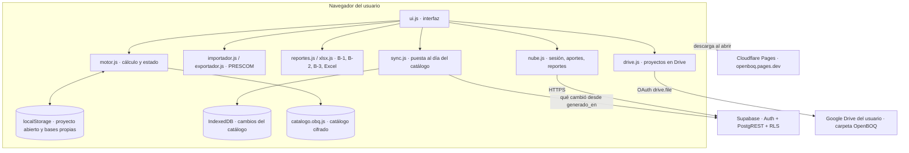

# OpenBOQ: cómo está armado

Qué corre en el navegador, qué hace cada servicio externo y qué dato viaja a dónde.
Estado a la versión **2.6**.

---

## 1. La idea

**OpenBOQ no tiene backend propio.** Es un sitio estático: HTML, CSS y JavaScript que el navegador
descarga y ejecuta. El cálculo de precios unitarios, cómputos, cronograma, reportes, Excel y la
lectura y escritura de archivos de PRESCOM ocurren en la máquina del usuario.

Los servicios externos hacen tareas puntuales y **ninguno es indispensable para calcular**:

| Servicio | Para qué | Si se cae |
|---|---|---|
| **Cloudflare Pages** | entrega los archivos del sitio | no se puede abrir la aplicación; una vez abierta sigue funcionando |
| **Supabase** (Postgres + Auth) | inicio de sesión, puesta al día del catálogo, aportes y reportes | se trabaja con el catálogo que trae la aplicación |
| **Google** | identidad (vía Supabase) y Drive del usuario | se trabaja con archivos `.boq` locales |

---

## 2. Frontend

Sin framework, sin compilación, sin dependencias en producción. Cada archivo es un módulo IIFE que
expone un objeto global (`MOTOR`, `IMPORTADOR`, `NUBE`, `DRIVE`, …).

| Archivo | Qué hace |
|---|---|
| `js/motor.js` | **Cálculo y estado.** Proyecto, módulos, ítems, insumos, análisis con la cadena de incidencias, cómputos, cronograma con predecesoras y curva S, bases propias, lectura y escritura del `.boq`. Es la única pieza que modifica el proyecto. |
| `js/ui.js`, `js/ui2.js` | **Interfaz.** Menús, pestañas, rejillas editables, diálogos, pantalla de inicio, modo simple de cuatro pasos y el sistema de «cambios en prueba» (nada se aplica sin confirmar). |
| `js/importador.js` | Lee proyectos de PRESCOM: el contenedor comprimido y los archivos sueltos. Nunca escribe sobre los archivos del usuario. Conserva lo que OpenBOQ no usa (membrete, rótulos) para devolverlo intacto. |
| `js/exportador.js` | Escribe el proyecto en formato PRESCOM: genera los archivos binarios, copia los del original y arma el ZIP a mano, con el texto en Windows-1252. |
| `js/reportes.js` | Formularios imprimibles B-1, B-2 y B-3, requerimiento de insumos, planilla de cómputos, cronograma y resumen por módulos. |
| `js/xlsx.js` | Genera un `.xlsx` real (Office Open XML con CRC propio), sin librerías. |
| `js/nube.js` | Todo lo que habla con Supabase, con `fetch` plano contra la API REST. Sin SDK. |
| `js/nube-config.js` | Dirección de Supabase, clave `anon` y `client_id` de Google. **Públicos a propósito.** |
| `js/drive.js` | Permiso de Google Drive y lectura/escritura de la carpeta OpenBOQ. Ver [GOOGLE-DRIVE.md](GOOGLE-DRIVE.md). |
| `js/sync.js` | Pone al día el catálogo con lo que cambió en Supabase desde que se generó. |
| `js/cifrado.js` | Abre el catálogo publicado (AES-256-GCM). |
| `js/acceso.js` | Indicador de conexión de la barra inferior. No bloquea nada. |

### Estado en el navegador

| Almacén | Qué guarda |
|---|---|
| `localStorage` | proyecto abierto, bases propias, sesión de Supabase, cola de aportes, preferencias (tema, modo simple) |
| `sessionStorage` | token de Drive de la pestaña (una hora) |
| `IndexedDB` | cambios del catálogo bajados de Supabase |

Borrar los datos del navegador borra el proyecto abierto. Por eso guardar produce un archivo:
`.boq` local o en Google Drive.

### Formato `.boq`

Un JSON con el proyecto completo: módulos, ítems, insumos, análisis, incidencias, cómputos,
cronograma y parámetros. Legible y fácil de procesar con otras herramientas.

---

## 3. El catálogo de precios

- Se publica **cifrado** en `data/catalogo.obq.js`. La clave la arma la propia aplicación, así que no
  es un candado: evita que el catálogo entero se descargue con un solo pedido, nada más.
- En desarrollo, si existe `data/catalogo.js` sin cifrar, `index.html` usa ese. No se versiona.
- Si ninguno está o el descifrado falla, la aplicación arranca igual y se trabaja con bases propias.
- Los precios son **de referencia**: provienen de bases de terceros, de la revista de precios y de
  aportes de usuarios, con una curaduría manual.

### Puesta al día

La aplicación arranca con el catálogo que trae y después pregunta a Supabase qué cambió desde
`generado_en`:

| Pieza | Dónde | Qué hace |
|---|---|---|
| `generado_en` | catálogo | con qué estado de la base se armó |
| `v_catalogo_precios` | Supabase | precio vigente por base e insumo |
| `obq_hay_cambios(desde)` | Supabase | cuántas filas cambiaron y hasta qué marca |
| `js/sync.js` | navegador | baja de a bloques, guarda en IndexedDB y aplica |
| `MOTOR.aplicarDelta` | navegador | cambia el precio **y rehace los costos** de los análisis afectados |

La marca de tiempo es siempre la del servidor. Sin red, sin IndexedDB o con Supabase pausado, se
sigue trabajando con el catálogo del archivo.

---

## 4. Supabase

Postgres administrado. El navegador le habla directo por HTTPS. La clave `anon` es pública: las
políticas **RLS** deciden qué se puede hacer con ella. La clave `service_role` salta el RLS y
**nunca** se versiona.

El esquema está en `supabase/`, en archivos numerados que se aplican en orden:

| Archivo | Contenido |
|---|---|
| `01_esquema.sql` | catálogo: `bases`, `insumos`, `precios_insumo`, `apus`, `apu_componentes` |
| `02_curaduria.sql`, `04_curar.sql` | vistas y funciones de curaduría de precios |
| `03_cuentas.sql` | aportes y reportes |
| `05_delta.sql` | marcas `actualizado_en`, triggers y la vista pública del catálogo |
| `06_seguridad_vistas.sql`, `08_seguridad_linter.sql` | vistas con `security_invoker` y permisos revocados |
| `07_proyectos.sql`, `09_tope_proyectos.sql` | proyectos en la cuenta (anterior a Drive) |
| `10_…`, `11_…` | depuración de descripciones y bases |
| `13_uso_usuarios.sql` | resumen de uso por cuenta |

### Qué toca el navegador

| | Tabla | Identificado | Cómo viaja |
|---|---|---|---|
| **Aportes** | `aportes` | **no**: la tabla no tiene usuario ni correo | se encolan y se mandan con horas de desfase, en otra sesión |
| **Reportes** | `reportes` | sí, con correo | para poder responder |

El desfase de los aportes existe para que no se puedan cruzar con la hora de otra acción del
mismo usuario. Del análisis viaja solo lo técnico (insumo, unidad, precio, rendimiento); cantidades
de obra, montos, cómputos, nombre del proyecto y de la entidad se filtran en `armarAporte()`.

### Autenticación

Solo con Google, vía Supabase (`/auth/v1/authorize?provider=google`), en una ventana aparte para
no perder el trabajo en pantalla. Al volver, la aplicación guarda la sesión y limpia la dirección.
La sesión se renueva sola con el *refresh token*.

---

## 5. PRESCOM, ida y vuelta

> El módulo de PRESCOM (`js/importador.js` y `js/exportador.js`) **no se distribuye en el
> repositorio público**: está disponible en <https://openboq.pages.dev>. Sin él, la aplicación
> arranca igual y no muestra las opciones de importar y exportar (`pruebas/sin-prescom.test.js`).

**Importar:** `importador.js` abre el contenedor, lee ítems, análisis, insumos e incidencias, y
guarda los archivos que no usa para devolverlos después.

**Exportar:** `exportador.js` genera los archivos del proyecto y los empaqueta con el mismo nombre
adentro y afuera. Tres restricciones del formato que el código respeta:

1. **El nombre es uno solo.** PRESCOM busca los archivos internos por el nombre del contenedor; por
   eso renombrar el archivo desde Windows lo rompe. Se exporta de nuevo con otro nombre.
2. **Tope por análisis:** 30 materiales, 10 de mano de obra y 20 de equipo. Se avisa antes de
   exportar.
3. **Texto en Windows-1252**, no UTF-8.

**Al centavo:** PRESCOM guarda subtotales con 3 decimales y el precio unitario con 2, y los dígitos
que descarta deciden algunos redondeos. En un proyecto importado manda el precio unitario del
archivo; el B-2 lo muestra como «redondeo del archivo de origen» y se suelta en cuanto el análisis
cambia.

Lo que PRESCOM no puede guardar (cómputos, cronograma, códigos propios) queda solo en el `.boq`.

---

## 6. Incidencias

La cadena de recargos es un **dato del proyecto**, no está escrita en el código. Hay un formato
oficial siempre disponible y el usuario puede crear formatos propios.

| Concepto | Valor por defecto |
|---|---|
| Cargas sociales | 55,00 % de la mano de obra |
| IVA mano de obra | 14,94 % de (mano de obra + cargas) |
| Herramientas menores | 5,00 % del total de mano de obra |
| Gastos generales | 10,00 % |
| Utilidad | 7,00 % |
| IT | 3,09 % |

No hay redondeos intermedios: solo se redondea el precio unitario final. Al importar de PRESCOM se
respetan los porcentajes del archivo.

---

## 7. Caché y versiones

1. **Caché HTTP.** Cada archivo propio se pide con `?v=N`. Al publicar se sube `N` en `index.html`
   y en `sw.js`; `pruebas/version.test.js` falla si los números se separan.
2. **Service worker (`sw.js`).** No cachea nada y borra cachés viejos: existe para que la
   aplicación sea instalable. Sin internet no arranca; una vez abierta funciona entera.
3. **`localStorage`.** Es el trabajo del usuario: publicar una versión nueva no lo toca.

---

## 8. Aplicación de escritorio

`escritorio/` empaqueta el mismo sitio en Electron con un servidor interno en `127.0.0.1`, para
Windows 7 a 11 (canales `universal`, `x64` y `arm64`). La aplicación web no cambia: la ventana
carga los mismos archivos. Instrucciones en `escritorio/LEEME-INSTALACION.md`.

---

## 9. Seguridad: qué protege qué

- **Proyectos:** en el navegador y en el Drive del usuario, con alcance `drive.file`. Ningún
  servidor de OpenBOQ los recibe.
- **Tablas de Supabase:** protegidas por RLS. Las vistas corren con los permisos de quien consulta
  (`security_invoker`) y las internas están revocadas para `anon` y `authenticated`.
  `pruebas/sql-supabase.test.js` lo comprueba contra un PostgreSQL local (se omite si no hay).
- **Catálogo:** cifrado contra la descarga masiva, no contra quien lea el JavaScript.
- **Todo lo que corre en el navegador se puede saltear.** Las reglas que importan viven en Postgres.

---

## 10. Pruebas

Archivos `pruebas/*.test.js` sin framework: cada uno arma un DOM con `jsdom`, evalúa los scripts
como el navegador y termina con `process.exit`. `npm test` los corre uno por uno.

Los `*.manual.js` tocan servicios reales y necesitan credenciales locales: no corren con `npm test`.
